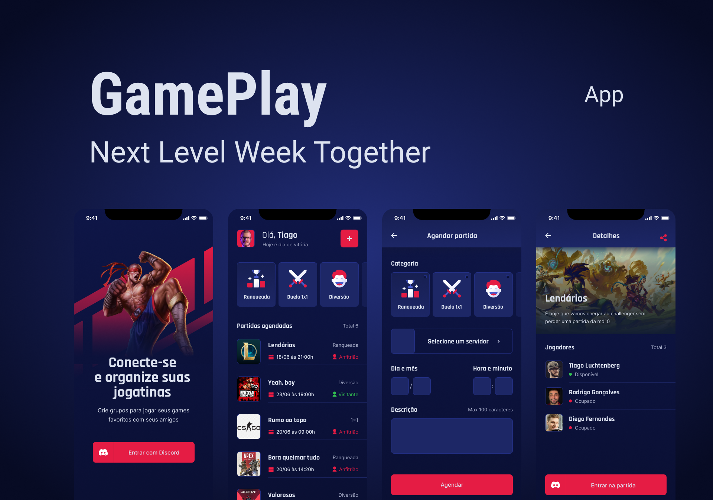

<h1 align="center">
  GamePlay
</h1>

<p align="center">
  

  
</p>

## 💻 Projeto

App que conecta e organiza jogos com os amigos. Crie grupos para jogar games favoritos com seus amigos com autenticação com Discord.

## ✨ Tecnologias

- [x] React Native
- [x] Typescript
- [x] Expo
- [x] Context API
- [x] Async Storage
- [x] Vector Icons
- [x] React Native Svg e Svg Transform
- [x] Axios
- [x] Gradient colors
- [x] OAuth2 Discord
- [x] Expo Google Fonts
- [x] React Navigation Stack
- [x] React Native Gesture Handler
- [x] Expo Authentication
- [x] React Native Share
- [x] Deep Link

## :hammer_and_wrench: Features

- [x] Autenticação Social OAuth2 com servidor do Discord.
- [x] Obtém perfil do usuário cadastro no Discord (username e avatar);
- [x] Lista os servidores do Discord que o usuário faz parte;
- [x] Permite realizar o agendamento de partidas;
- [x] Permite filtrar as partidas por categoria;
- [x] Exibe se a partida foi agendada em um servidor próprio (anfitrião) ou em servidores de outros (convidado);
- [x] Compartilha o convite para ingressar no servidor do usuário;
- [x] Permite redirecionar o usuário para o seu próprio servidor;
- [x] Disponibiliza a função de Logout.

## 🔖 Layout

Você pode visualizar o layout do projeto através [desse link](https://www.figma.com/community/file/991338130828322960). É necessário ter conta no [Figma](http://figma.com/) para acessá-lo.

## Executando o projeto

Utilize o **yarn** ou o **npm install** para instalar as dependências do projeto.
Em seguida, inicie o projeto.

```cl
expo start
```

Lembre-se de criar o seu App no servidor do Discord para obter as credencias de autenticação. Em seguida, defina no arquivo .env as configurações do seu App (remova o example do arquivo .env.example).

 ```cl
REDIRECT_URI=
SCOPE=
RESPONSE_TYPE=
CLIENT_ID=
CDN_IMAGE=
```

## 📄 Licença

Esse projeto está sob a licença MIT. Veja o arquivo [LICENSE](LICENSE.md) para mais detalhes.
